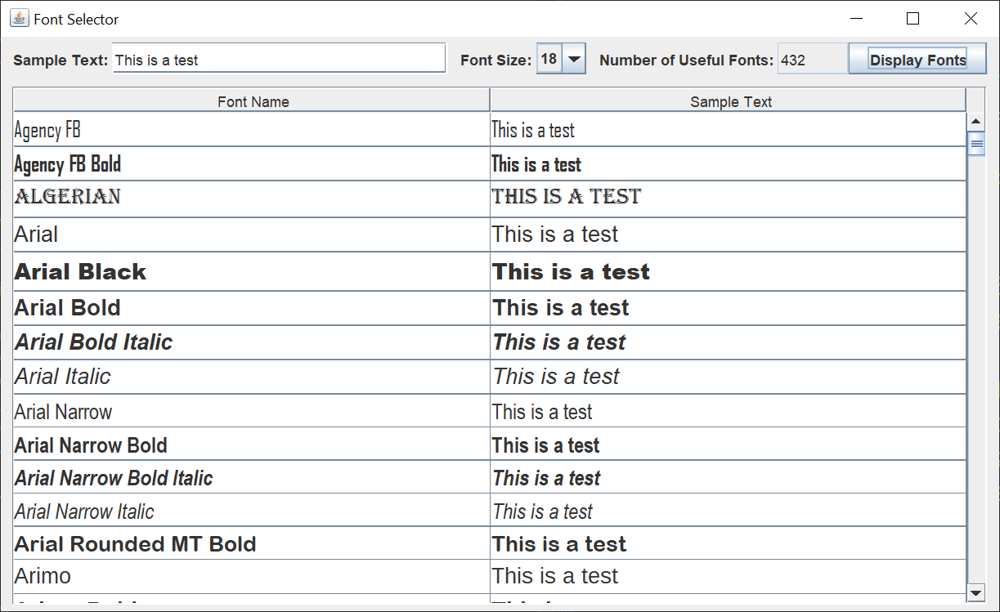
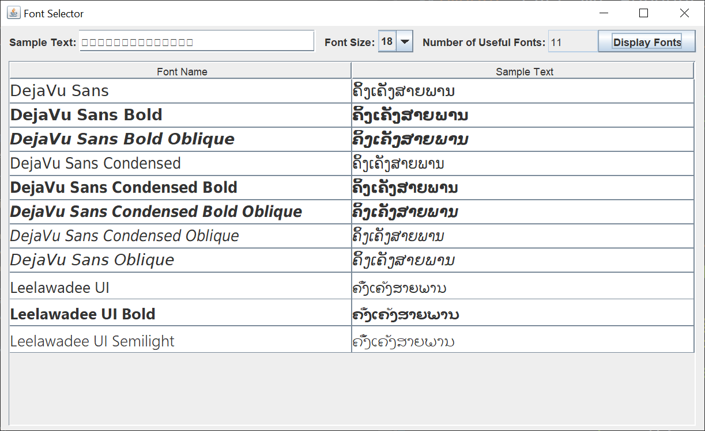

# Font Selector

## Introduction

A while back, I answered a Stack Overflow question about a font that improperly displayed a word in the Lao language.  I wrote a Swing GUI to answer the Stack Overflow question.

If you’re not familiar with Java Swing, Oracle has an excellent tutorial to get you started, [Creating a GUI With JFC/Swing](https://docs.oracle.com/javase/tutorial/uiswing/index.html). Skip the Netbeans section.

I decided to write a more general font selector GUI for two reasons.

1.  I wanted to pick a script font for a different GUI I was creating.  I had to use OpenOffice to look at my available fonts.

2.  I thought it would make a good Swing application for GitHub.

Here's the Font Selector GUI showing which fonts on my computer display an English phrase.  I have 432 font variations that can display the Sample Text from the JTextField.

At the top of the GUI, you can type in or copy / paste sample text.  You can select from several common font sizes.  After you left-click on the Display Fonts JButton, you see a sample of each font and at the top, the total number of available fonts that Java recognizes.

Here's the Font Selector GUI showing which fonts on my computer display a word in the Lao language.  You can see the boxes in the Sample Text JTextField.  My default Swing GUI font can't display the word.  Only 11 font variations on my system can, and only the DejaVu font can display the word with the glyphs in the correct position.

## Explanation

The Swing GUI consists of four classes; FontSelectorGUI, FontTableCellRenderer, FontDisplayListener, and FontDisplayRunnable.

The FontSelectorGUI class is the main GUI class.  The JFrame, entry JPanel, and display JPanel are created in this class.  The JFrame is created in the run method, and the JPanels are created in separate methods.  The entry JPanel uses a BoxLayout, while the display JPanel uses a BorderLayout.

The FontTableCellRenderer class is the JTable cell renderer class responsible for rendering the JTable cells in the different fonts.

The FontDisplayListener class responds to the JButton of the entry JPanel.  Because the creation of the JTable rows takes a while, a separate FontDisplayRunnable updates the JTable rows in a separate thread.  Doing this keeps the GUI responsive.
